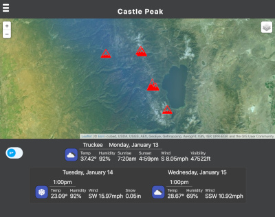

# Map n Weather

Map, and Weather, together. 

I wanted to visualize the weather, so the map can display current clouds, precip, wind, and temp.

Map uses Leaflet.js
Weather data from OpenWeatherMap

React/TypeScript demo project

To Run:
- npm install
- npm start

